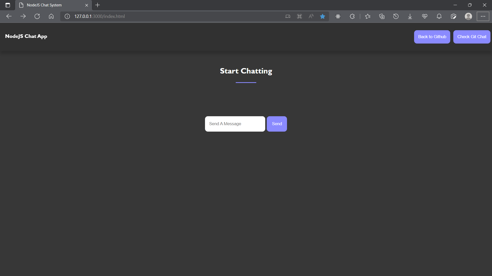

# Node JS Chat System
***

This is a simple chat system in node.js that uses websockets. This isnpired my current side project Gitchat. 
Enables multichat.

## Requirements

1. Node.js
2. NPM (Package Manager)
3. Websocket API
4. Express Server

## Installation

Clone the repository

``>git clone https://github.com/grayoj/Web-sockets-and-Nodejs-chat-system.git``

Install the dependencies

``npm install ws``
``npm install express``

Run

``npm start``

